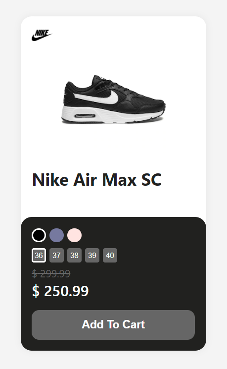

# ModernProductCard

ModernProductCard is a ready-to-use product card component for your e-commerce. The component accepts to receive several SKU's of a product, as it has selectors so that the customer can choose and add the same to the cart without having to go to the product page.

## Preview

<div>
  
</div>

## Usage

### Install

Install the `galactus-store-components` library:

```sh
npm install galactus-store-components
```

### Import

Import the component on your page or inside another component:

```javascript
import { ModernProductCard } from 'galactus-store-components'
```

### Declaration

Declare the component wherever you need it and pass the required props and customize it with the non-mandatory props:

```javascript
<ModernProductCard
  productData={products}
  customContents={contents}
  customStyles={styles}
/>
```

### Props

#### 1 - productData

| Prop | Type | Default | Required | Description |
| --- | --- | --- | --- | --- |
| `title` | `string` | | ✓ | Product title |
| `brand` | `object` | `null` | ✗ | Product brand information, counting: `name` and `image` |
| `price` | `object` | | ✓ | Product price information, counting `currencyPrice`, `sellingPrice` and `scratchedPrice` |
| `slug` | `string` | | ✓ | Product slug |
| `sku` | `array` | | ✓ |  Product sku information, counting `image`, `hexadecimalColor` and `sizes` |

**1 - productData** typing structure:

```typescript
interface ProductDataProps {
  title: string;
  brand?: {
    name: string;
    image: string;
  };
  price: {
    currencyPrice: string;
    sellingPrice: number;
    scratchedPrice?: number;
  };
  slug: string;
  sku: Array<{
    image: string;
    hexadecimalColor?: string;
    sizes?: Array<string>;
  }>;
}
```

#### 2 - customContents

| Prop | Type | Default | Required | Description |
| --- | --- | --- | --- | --- |
| `buttonText` | `string` | | ✓ | Button card text |
| `addToCartFunction` | `void` | | ✓ | Function that adds the product to the cart |

**2 - customContents** typing structure:

```typescript
interface CustomContentsProps {
  buttonText: string;
  addToCartFunction: () => void;
}
```

#### 3 - customStyles

| Prop | Type | Default | Required | Description |
| --- | --- | --- | --- | --- |
| `cardContainer` | `object` | `defaultStyle` | ✗ | Card container styles, counting `width`, `height`, `fontFamily`, `fontWeight`, `borderRadius`, `backgroundColor` and `boxShadow` |
| `topSubcontainer` | `object` | `defaultStyle` | ✗ | Top subcontainer styles, counting `width`, `height`, `borderRadius` `padding`, and `color` |
| `title` | `object` | `defaultStyle` | ✗ | Title styles, counting `alignItems`, `fontSize` and `lineHeight` |
| `bottomSubcontainer` | `object` | `defaultStyle` | ✗ | Bottom subcontainer styles, counting `width`, `height`, `borderRadius` `padding`, `backgroundColor` and `color` |
| `colorPicker` | `object` | `defaultStyle` | ✗ | Color picker styles, counting `width`, `height`, `border`, `borderRadius` and `cursor` |
| `sizePicker` | `object` | `defaultStyle` | ✗ | Size picker styles, counting `width`, `height`, `fontSize`, `border`, `borderRadius`, `backgroundColor`, `color` and `cursor` |
| `activePicker` | `object` | `defaultStyle` | ✗ | Active picker styles, counting `border` |
| `scratchedPrice` | `object` | `defaultStyle` | ✗ | Scratched price styles, counting `fontSize` and `color` |
| `sellingPrice` | `object` | `defaultStyle` | ✗ | Selling price styles, counting `fontSize`, `color` and `fontWeight` |
| `buttonContainer` | `object` | `defaultStyle` | ✗ | Button container styles, counting `width` and `height` |
| `button` | `object` | `defaultStyle` | ✗ | Button styles, counting `width`, `height`, `borderRadius`, `border`, `backgroundColor`, `color`, `fontSize`, `fontWeight` and `cursor` |

**3 - customStyles** typing structure:

```typescript
interface CustomStylesProps {
  cardContainer?: {
    width?: string;
    height?: string;
    fontFamily?: string;
    fontWeight?: string;
    borderRadius?: string;
    backgroundColor?: string;
    boxShadow?: string;
  },
  topSubcontainer?: {
    width?: string;
    height?: string;
    borderRadius?: string;
    padding?: string;
    color?: string;
  },
  title?: {
    alignItems?: string;
    fontSize?: string;
    lineHeight?: string;
  },
  bottomSubcontainer?: {
    width?: string;
    height?: string;
    borderRadius?: string;
    padding?: string;
    backgroundColor?: string;
    color?: string;
  },
  colorPicker?: {
    width?: string;
    height?: string;
    border?: string;
    borderRadius?: string;
    cursor?: string;
  },
  sizePicker?: {
    width?: string;
    height?: string;
    fontSize?: string;
    border?: string;
    borderRadius?: string;
    backgroundColor?: string;
    color?: string;
    cursor?: string;
  },
  activePicker?: {
    border?: string;
  },
  scratchedPrice?: {
    fontSize?: string;
    color?: string;
  },
  sellingPrice?: {
    fontSize?: string;
    color?: string;
    fontWeight?: string;
  },
  buttonContainer?: {
    width?: string;
    height?: string;
  },
  button?: {
    width?: string;
    height?: string;
    borderRadius?: string;
    border?: string;
    backgroundColor?: string;
    color?: string;
    fontSize?: string;
    fontWeight?: string;
    cursor?: string;
  }
}
```
